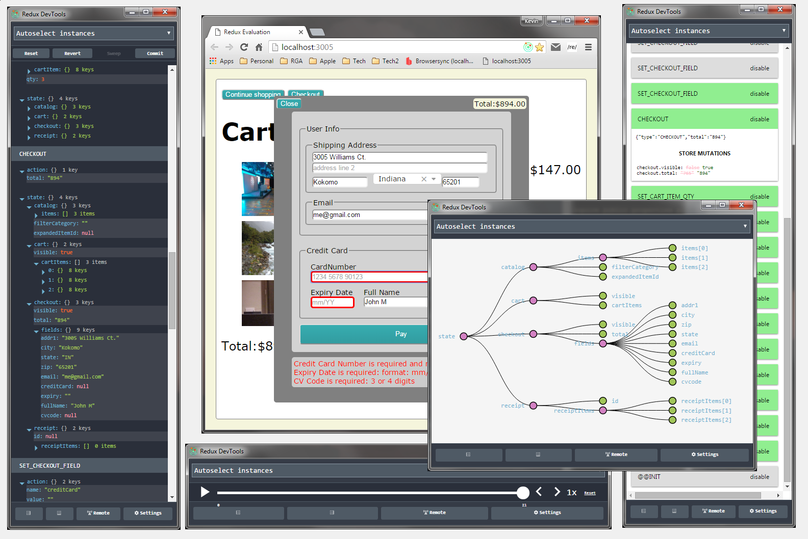

# ReduxEvaluation

**Table of Contents**

- [Overview](#overview)
- [App State](#app-state)
  - [State Specification](#state-specification)
  - [State Implementation](#state-implementation)
  - [State Promotion](#state-promotion)
  - [State Transition](#state-transition)
- [Simplified UI Components](#simplified-ui-components)
  - [React Approach](#react-approach)
  - [Redux Approach](#redux-approach)
  - [Redux Example](#redux-example)
- [Time Travel](#time-travel)
- [Conclusion](#conclusion)

## Overview

This project is an evaluation of the
[Redux](https://github.com/reactjs/redux/) framework (a popular
[Flux](https://facebook.github.io/flux/) implementation)
used in conjunction with [React](https://facebook.github.io/react/).

The app itself is a Shopping Cart, which is part of the
[CodeWinds](http://codewinds.com/) React 101 training course.

The app has been implemented in two different ways (found in different
branches of this project).  This allows you to directly compare the
two different implementations.  The branches are:

 - [**PlainReact**](../PlainReact): The original React app without
   Redux.  The top-level [`<App>`](../PlainReact/src/comp/app.jsx)
   component maintains application state, and contains the function to
   alter this state.  React properties are trickled down from this
   `<App>` component throughout the entire containment tree.

 - [**ReduxReact**](../ReduxReact): A refactor of this same React app,
   utilizing the Redux framework.

What follows are the details of this Redux refactor.


## App State

The Redux-refactored app maintains a single persistent store,
employing the Redux pattern of Actions and Reducers.  In essence these
are business events, that drive our apps state transition.


### State Specification

The complete specification of our app state is shown here. 


```javascript
{
  catalog: {              // our catalog of items which can be purchased
    items:          [],   // items list [ { id: <int>, name: <string>, price: <int>, img: <string>, category: <string>, desc: <string>, details: <string> ]
    filterCategory: null, // item filter category <String> "" for show all
    expandedItemId: null, // item id to expand <int>, null for no expansion
  },

  cart: {             // our shopping cart
    visible:   false, // is cart dialog visible <boolean>
    cartItems: [],    // shopping cart item list [ { ...item, qty: <int> } ]
  },

  checkout: {       // checkout data (for purchase)
    visible: false, // is checkout dialog visible <boolean>
    total:   null,  // total amount being checked out <number>

    fields: {     // NOTE: These checkout.fields MUST MATCH the <Checkout> form field names
      addr1:      "", // <string>
      addr2:      "", // <string>
      city:       "", // <string>
      state:      "", // <string>
      zip:        "", // <string>
      email:      "", // <string>
      creditCard: "", // <string>
      expiry:     "", // <string>
      fullName:   "", // <string>
      cvcode:     "", // <string>
    }
  },

  receipt: {      // our shopping receipt
    id:           null, // receipt id <string> ... when supplied, receipt dialog is visualized
    receiptItems: [],   // receipt item list [ { ...cartItems } ]
  }

}
```

**Please notice that structural depth is maintained to emphasize
ownership!**  That is contrast to the original (non Redux)
implementation:

```javascript
this.state = {
  category:     null,  // filter category <String>
  itemExpanded: null,  // item to expand


  // ***
  // *** state related to cart
  // ***

  cartOpen: false,
  cartItems: [],


  // ***
  // *** state related to receipt
  // ***

  receiptId:    null,
  receiptItems: [],   // type: cartItems (with qty)


  // ***
  // *** state related to checkout
  // ***

  checkoutOpen: false, // is the checkout dialog open?
  total:        null,  // currency KJB: unsure yet how this is going to work

  // NOTE: fields within our checkeout MUST match <Checkout> form field names
  addr1:      "", // string
  addr2:      "", // string
  city:       "", // string
  state:      "", // string
  zip:        "", // string
  email:      "", // string
  creditCard: "", // string
  expiry:     "", // string
  fullName:   "", // string
  cvcode:     "", // string
}
```


### State Implementation

The business logic that maintains the state definition/transition can
be found in [src/state/](./src/state/).

```
src/
  state/
    actionTypes.js .............. all action types (defined constants)
    actionCreators.js ........... all action creators

    appState.js ................. appState top-level reducer (a Redux combineReducer)

    catalog.js .................. appState.catalog reducer (a Redux combineReducer)
    catalog.items.js
    catalog.filterCategory.js
    catalog.expandedItemId.js

    cart.js ..................... appState.cart reducer (a Redux combineReducer)
    cart.visible.js
    cart.cartItems.js

    checkout.js ................. appState.checkout reducer (a Redux combineReducer)
    checkout.visible.js
    checkout.total.js
    checkout.fields.js

    receipt.js .................. appState.receipt reducer (a Redux combineReducer)
    receipt.id.js
    receipt.receiptItems.js

    test/ ....................... all state transition tests
      ... snip snip
```

Please note that the structural depth of our state (shown above) is
implicitly defined through our reducers, and is is reflected by the
javascript module names (below).


### State Promotion

Our app state is a Redux store, and is promoted through the
react-redux `<Provider>` component.  This is setup in our bootstrap
process, found in [src/browser.jsx](./src/browser.jsx)).

This makes the app state available to any component that monitors the
Redux store (via the Redux-Redux connect() function.  In our case we
utilize a value added `wrapCompWithInjectedProps()` function found in
[ReduxUtil](.src/util/redux-util.js).

Under the covers, this bit of Redux magic is accomplished through the
React Context feature.


### State Transition

Our state definition and transition is maintained by a series of
actions that are interpreted by a graph of reducers (found in
[src/state](src/state)).  This in conjunction with the Redux
dispatcher, provides a complete solution for maintaining our state.

[Action Creatores](./src/state/actionCreators.js) promote the public
API to our state changing business logic.  You can think of them as
event structures.  Each action will take a different set of
parameters, specific to the action at hand.

Actions are processed by simply dispatching them through the Redux
`dispatch()` function.  

As an example, let's say you have an item who's detail should be
expanded in our GUI.  You simply locate the desired action
in [src/state/actionCreators.js](src/state/actionCreators.js),
and publish it with the Redux dispatch mechanism.  This task is
accomplished in one simple line of code:

```javascript
import * as AC from 'src/state/actionCreators'
...
  dispatch(AC.toggleItemDetail(item))
```

Typically this is accomplished directly in our component wrapper,
through an injected property that promotes a callback function to the
presentation component.  The example above was taken from the
[ItemRow](src/comp/item-row.jsx) component (search for
`"toggleItemDetailFn"`).


## Simplified UI Components

The UI components were simplified, in the sense that the large number
of properties were greatly minimized.  In many cases component properties
were completely eliminated.  In addition, the business logic that
modifies our state is promoted through a well-defined and stable
pattern.

### React Approach

Prior to this refactor state and functionality filtered down from the
top-level App component, by passing component properties.  The reason
for this was that only the App component had access to the top-level
state and the business functions that transformed the state (via
React's `setState()` transformation mechanism).

This property chain was very tedious.  In some cases, you may have a
3rd or 4th level component that required a callback defined in the
root App.  This made the property chain very cumbersome, because all
components in the chain had to be aware of this.  In many cases
intermediate components merely passed callbacks through to the next
level.  It is also difficult to trace back this chain to find the
logic.

### Redux Approach

In our new refactored approach:
 - All our components have access to the app state.
 - In addition, any component can dispatch well-defined business
   actions that formally alter the app state.

**Under the covers**, we still utilize component properties internally
(both data and behavior) to keep our React components simple.  It's
just that these properties are dynamically injected at the component
level.  This can roughly be thought of as a type of Dependency
Injection (*although not managed by an external agent*).

Take a look at the [`<Catalog>`](src/comp/catalog.jsx) component.  In
essence we wrap an internal private component (`Catalog$`) with a
publicly promoted component (`Catalog`) that:
 - has access to our Redux appState and dispatch()
 - and dynamically injects the needed properties (both data and
   behavior) to the internal component

This is a slight twist on what Redux calls the "containing component"
(e.g. our public `Catalog`), and the "presentation component"
(e.g. our internal `Catalog$`).

Components can still require public properties passed to them from
their parent component, but this is used for finer-grained control
that is not based on state, and is somewhat rare.  Each component
declares it's expected properties, through the standard `propTypes`
React mechnism.  

> As an example [`<ItemRow>`](src/comp/item-row.jsx) has to be told what
> item it is rendering (through the "item" property).  This can't be
> defined from state because there are many items, rather the parent
> `<Catalog>` iterates through all items rendering an `<ItemRow
> item={item}/>` for each.

In summary, component property that are fundamentally based on state
can be handled internally. For other non-state characteristics, a
property can be passed from parent to child.


### Redux Example

As an example, in our old logic, the
[App](../PlainReact/src/comp/app.jsx) component had an App.buyItem()
function that had to be passed from `<App>` through `<Catalog>` into
`<ItemRow>` where the Buy button was located.  Under the new
refactored code, the buyItemFn() lives directly in
[`<ItemRow>`](../ReduxReact/src/comp/item-row.jsx) injected by our
Redux process.  **In addition**, it's implementation is a single line
that dispatches a well-known action.  **No fuss, No muss.**

Underlying this approach, you no longer have a mish mash of business
logic residing at the top-level App component.  Our logic is much more
consistent **following a well established repeating pattern**.

The change in our top-level `<App>` component was so dramatic that it
went from a class with 15 methods and over 300 lines (found
[here](../PlainReact/src/comp/app.jsx)) to a React functional
component with an extremely simple process rendering 9 DOM lines
(found [here](../ReduxReact/src/comp/app.jsx)).

The end result is our code is much easier to follow.  Property passing
is minimized, and the "cause and effect" is localized to each component.
You no longer have to follow a long chain back to the source.


## Time Travel

Because our state is immutable, each state transition can be
optionally monitored, providing things like undo/redo etc.  **I would
highly recommend installing the Redux [DevTools Chrome
Extension](https://github.com/zalmoxisus/redux-devtools-extension)**.
*Our app has been tooled to automatically hook to this extension when
present*.  With this, you can monitor state transitions (and go back
and forth in time) through the following means:

- Log Monitor: showing each Action and the new resulting state
- Diff Monitor: showing each Action with a DIFF of the old/new state
- Slider Monitor: allowing you to move back and forth in time
- Chart Monitor: showing your state in a graphical tree




## Conclusion

Within any [React](https://facebook.github.io/react/) app, I would
strongly suggest utilizing one of the
[Flux](https://facebook.github.io/flux/) patterns.  The most popular
and well-documented Flux library is
[Redux](https://github.com/reactjs/redux/).

This exercise has shown that applying Redux can significantly simplify
your app, as well as bring order to what otherwise could very quickly
turn into the "Wild Wild West".

I disagree with the sentiment that says: "Don't use Flux till you need
it" ([Pete Hunt's React
HowTo](https://github.com/petehunt/react-howto)).  You can say that
for "simple apps" it is an overkill, but I would argue that even
simple apps can benefit.  The shopping cart app is "pretty simple"
(i.e. it is a training exercise), and yet in my estimation we greatly
benefited from the Redux injection!

The real development effort was setting up the
[actions](./src/state/actionCreators.js) and [reducers](./src/state).
Once you get accustomed to it, it is pretty straight forward (**and
testable**).  

Once your actions and reducers are in place, invoking the business
functionality is a breeze (it's simply a matter of dispatching an
action).

In summary, building on the Redux framework:

 - Simplifies Component development
   - by minimizing property passing bloat
   - and localizing cause-and-effect
 - Provides a common set of business functions that transition state
   - Self-documenting the total set of business functions that are
     available
   - Providing better unit test capability
 - Builds on a solid foundation that promotes consistency
   - Providing better app scalability
